# Интерактивный NPC на Unreal Engine. Часть 2: RAG, эмоции и function calling

***

В [первой части](https://habr.com/ru/articles/807561/) мы собрали прототип: интерактивного NPC в Unreal Engine (**STT** + **LLM** + **TTS** + **MetaHuman**).

NPC слышал игрока, отправлял распознанный текст в языковую модель, получал ответ и озвучивал его (с полноценным lipsync).

Но говорящая голова ещё не персонаж. Его представление о мире статично (зашито в system prompt), на любой запрос он отвечает одинаково безэмоционально и вежливо и никак не влияет на происходящее в игре.

Именно эти проблемы мы и попытались решить...

*Spoiler* - у нас получилось.

***

## Содержание

1. [Три проблемы прототипа и три решения](#1-%D1%82%D1%80%D0%B8-%D0%BF%D1%80%D0%BE%D0%B1%D0%BB%D0%B5%D0%BC%D1%8B-%D0%BF%D1%80%D0%BE%D1%82%D0%BE%D1%82%D0%B8%D0%BF%D0%B0-%D0%B8-%D1%82%D1%80%D0%B8-%D1%80%D0%B5%D1%88%D0%B5%D0%BD%D0%B8%D1%8F)

2. [NPC знает: Agent knowledge base](#2-npc-%D0%B7%D0%BD%D0%B0%D0%B5%D1%82-agent-knowledge-base)

3. [NPC чувствует: Expressive Agent](#3-npc-%D1%87%D1%83%D0%B2%D1%81%D1%82%D0%B2%D1%83%D0%B5%D1%82-expressive-agent)

4. [NPC действует: Agent function-calling](#4-npc-%D0%B4%D0%B5%D0%B9%D1%81%D1%82%D0%B2%D1%83%D0%B5%D1%82-agent-function-calling)

5. [Демо: NPC-торговец](#5-%D0%B4%D0%B5%D0%BC%D0%BE-npc-%D1%82%D0%BE%D1%80%D0%B3%D0%BE%D0%B2%D0%B5%D1%86)

6. [Проблема](#6-%D0%BF%D1%80%D0%BE%D0%B1%D0%BB%D0%B5%D0%BC%D0%B0)

# 1. Три проблемы прототипа и три решения

***

## Проблемы

* **NPC статичен** - он ничего не знает об игровом мире и, как следствие, выдумывает факты на ходу. Спросите NPC-торговца, есть ли у него плюмбус, и NPC, глазом не моргнув, выразит готовность его продать и даже назовёт цену.

* **NPC не может влиять на игровой мир**. Нельзя было попросить "продай пистолет, пожалуйста" и получить ствол в инвентарь, потратив при этом деньги.

* **NPC эмоционально плоский**. Один голос, одно выражение лица на любую реплику игрока (какой бы хамской она ни была).

***

## Решения

Каждый из недочётов прототипа мы закрыли своим механизмом:

* **[Agent knowledge base](#2-npc-%D0%B7%D0%BD%D0%B0%D0%B5%D1%82-agent-knowledge-base)** - база знаний (по принципам RAG) для NPC, синхронизированная с игровым миром. NPC анализирует запрос игрока, извлекает из БЗ факты и отвечает игроку в соответствии с ними.

* **[Expressive Agent](#3-npc-%D1%87%D1%83%D0%B2%D1%81%D1%82%D0%B2%D1%83%D0%B5%D1%82-expressive-agent)** - NPC анализирует тональность запроса игрока (не хамит ли), состояние игрока (не ранен ли), собственное состояние и вместе с текстовым ответом возвращает тэг эмоции, соответствующий ситуации. Этот тэг определяет, какую анимацию лица (MetaHuman) применить и какой сэмпл голоса использовать для клонирования при преобразовании текста в речь.

* **[Agent function-calling](#4-npc-%D0%B4%D0%B5%D0%B9%D1%81%D1%82%D0%B2%D1%83%D0%B5%D1%82-agent-function-calling)** - NPC анализирует запрос игрока, выбирает действие (из заданного списка) и возвращает его вместе с ответом; игровая логика выполняет действие.

Так NPC перестаёт быть просто говорящим болванчиком: он опирается на актуальное состояние игрового мира и способен на этот мир влиять.

***

## Схема работы

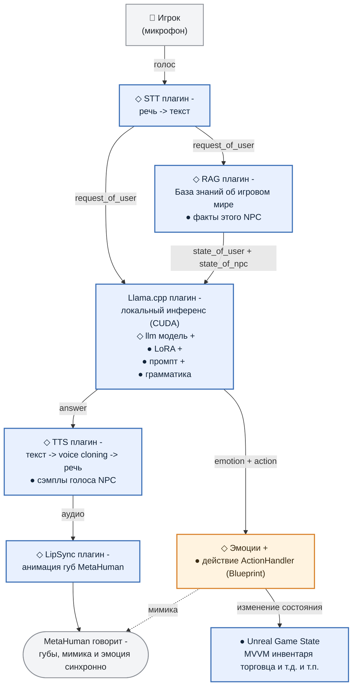

На схеме мы выделили общую для всех типов NPC часть (◇) (распознавание и синтез речи, lip sync для MetaHuman, инференс LLM) и часть которая меняется от NPC к NPC (●).

Все что относится непосредственно к персоналии NPC (● - *описание характера, сэмплы голоса под каждую эмоцию и набор действий которые ему доступны в игре*) хранится в Unreal Data Asset .

### Почему DataAsset

Главным образом для удобства. 
 
Чтобы добавить нового персонажа достаточно создать экземпляр `NPCDataAsset`, открыть его в Unreal Editor и заполнить поля по шаблону.

 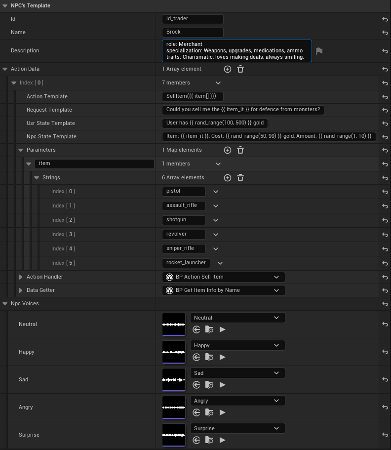

 * **Name**, **Description** - имя и описание характера персонажа.

 * **NpcVoices** - пять слотов под сэмплы голоса (`Neutral`, `Happy`, `Sad`, `Angry`, `Surprise`), в которые добавляются звуковые ассеты.

 * **ActionData** - массив действий доступных NPC в игре. Необходимо задать сигнатуру действия (`SellItem(item)`) и перечислить возможные значения параметров (`item: pistol, shotgun, rocket_launcher`). За каждым действием закреплено два Blueprint ассета:

   * **DataGetter** - функция сбора игровой информации перед отправкой её в LLM (см. [Agent knowledge base](#2-npc-%D0%B7%D0%BD%D0%B0%D0%B5%D1%82-agent-knowledge-base)).

   * **ActionHandler** - функция выполнения действия NPC. Именно она меняет игровой мир (см. [Agent function-calling](#4-npc-%D0%B4%D0%B5%D0%B9%D1%81%D1%82%D0%B2%D1%83%D0%B5%D1%82-agent-function-calling)).

 Ошибиться типом редактор не даст - в слот голоса не положить 3d mesh, в слот обработчика не выбрать Blueprint, который обработчиком не является.

 Т.о. новый NPC - это копия шаблона с другими значениями полей. Не надо писать код, не надо пересобирать проект.

***

## Немного про "контракт" общения с LLM. Что LLM получает и что отдаёт

**Json на входе** - три поля: сам запрос игрока (`request_of_user - результат STT преобразования`) плюс данные из игры: `state_of_user` и `state_of_npc` (см. [раздел 2](#%D0%BE%D1%82%D0%BA%D1%83%D0%B4%D0%B0-%D0%B1%D0%B5%D1%80%D1%91%D1%82%D1%81%D1%8F-%D0%BA%D0%BE%D0%BD%D1%82%D0%B5%D0%BA%D1%81%D1%82)):

```json
{
  "request_of_user": "покажи, что есть из оружия",
  "state_of_user":   "ранен, денег 250$",
  "state_of_npc":    "дробовик: 12 шт, цена 300$; пистолет: 3 шт, цена 150$"
}
```

**Json на выходе** - тоже три поля: тэг эмоции для мимики MetaHuman и голоса, реплика NPC для озвучки и действие в игре с параметрами:

```json
{
  "emotion": "Happy",
  "answer":  "Конечно, вот лучшие стволы в городе!",
  "action":  { "name": "ShowItemsByCategory", "parameters": { "category": "weapons" } }
}
```

Причём нарушить этот формат LLM физически не может. И структура объекта, и допустимые значения `emotion` и `action` заданы **грамматикой на уровне сэмплинга** - как именно, разберём в [разделе 4](#%D0%BD%D0%BE-%D0%B5%D1%81%D1%82%D1%8C-%D0%BD%D1%8E%D0%B0%D0%BD%D1%81-system-prompt-%D0%BD%D0%B8%D1%87%D0%B5%D0%B3%D0%BE-%D0%BD%D0%B5-%D0%B3%D0%B0%D1%80%D0%B0%D0%BD%D1%82%D0%B8%D1%80%D1%83%D0%B5%D1%82).

***

## На чём это работает

Каркас системы (◇ на схеме) собран из четырёх плагинов - все они опубликованы нами на Fab:

* **[ULlama](https://www.fab.com/listings/191b86f7-650d-4af8-a6dc-88f753e05968)** - инференс LLM внутри движка поверх `llama.cpp` с ускорением на CUDA. Этот плагин отвечает за работу как диалоговой модели (**Qwen3.5 2B в fp16**) так и embedding модели (**Qwen3-Embedding**) обеспечивающей семантический поиск по базе знаний ([раздел 2](#%D0%BA%D0%B0%D0%BA-%D1%80%D0%B0%D1%81%D0%BF%D0%BE%D0%B7%D0%BD%D0%B0%D1%91%D1%82%D1%81%D1%8F-%D0%BD%D0%B0%D0%BC%D0%B5%D1%80%D0%B5%D0%BD%D0%B8%D0%B5-%D0%B8%D0%B3%D1%80%D0%BE%D0%BA%D0%B0));

* **[SRS](https://www.fab.com/listings/96959d66-ab4a-4dc3-b416-385d46982bf8)** - распознавание речи игрока (STT), на модели **Qwen-STT**;

* **[SGS](https://www.fab.com/listings/82bb7c8a-7d09-4046-a0a1-dfb6ae412c8c)** - синтез речи с клонированием голоса (TTS), на модели **Qwen-TTS**;

* **[ULSS](https://www.fab.com/listings/d7fb5d8e-478f-49c7-b09c-3c36147ce4b4)** - анимация губ MetaHuman по аудио (LipSync).

Все работает локально. Никаких внешних API, платы за токены и GDPR. Правда у всего есть цена...

***

## Насколько такая система требовательна к железу

Главное, что нужно понимать про нагрузку: на видеокарте одновременно живут **четыре нейронки** - диалоговая LLM, модель эмбеддингов для базы знаний, STT и TTS модели. И всё это - вдобавок к самой игре.

По факту демо занимает примерно **13 ГБ** видеопамяти. То есть практическое требование - **карта уровня RTX 5070 Ti с 16 ГБ VRAM**.

Использовать видеокарты с меньшим кол-вом памяти можно: `llama.cpp/gguf` умеет держать часть слоёв модели на GPU, а часть считать на CPU. Требование по VRAM смягчается, но каждый вынесенный на CPU слой добавляет к задержке и пауза между вопросом игрока и ответом NPC превращается в неловкое молчание.

Потребление видеопамяти моделями не зависит от количества NPC на уровне. Сами модели от NPC к NPC не меняются - они общие. Меняются только LoRA-адаптеры (именно они и добавляют NPC характер), а они не весят практически ничего.

Поэтому на сцене спокойно может находиться несколько NPC одновременно: каждый со своим характером, голосом и набором действий, но все - поверх одного набора моделей в VRAM.

***

Далее разберём каждый компонент этой системы по отдельности.

# 2. NPC знает: Agent knowledge base

Перед тем как отправить запрос игрока в LLM, мы анализируем этот запрос на предмет того, что игрок хочет от NPC, извлекаем из базы знаний NPC факты игрового мира и добавляем их к запросу.

Так LLM будет отвечать, опираясь на реальное состояние игры. Осталось разобраться, что мы называем "базой знаний", потому что устроена она не совсем так, как принято в классическом RAG.

***

## Что на самом деле лежит в базе знаний

Обычно RAG работает с документами: текст режут на фрагменты, складывают в векторную базу, а на запрос достают самые похожие куски и подмешивают их в промпт. Наша база устроена несколько иначе. Она **не хранит** информацию о мире игры. В ней лежат только **намерения игрока**.

Т.е. то, чего он добивается от NPC своим запросом. Каждое намерение - это сигнатура вида "действие + параметры" (поле **intention**) с привязкой к своему **поставщику контекста** (поле **action**):

```json
[
  { "intention": "SellItem | item: pistol",  "action": { "name": "SellItem",  "parameters": { "item": "pistol" } } },
  { "intention": "SellItem | item: shotgun", "action": { "name": "SellItem",  "parameters": { "item": "shotgun" } } }
]
```

> Поле **action** в данном случае - не то действие, которое NPC исполнит. Это лишь **ключ к поставщику контекста**: по нему мы понимаем, какие факты из игры вытащить для этого намерения. Какое действие совершить, решает LLM - она может ответить и `OutOfStock`, и `NotEnoughGoldToBuy` на то же самое намерение `SellItem`.

Почему так, а не "сложить в базу все факты": факты меняются в рантайме (товар купили, деньги потратили, игрока ранили). Хранить их копию в базе - значит гарантированно рассинхронизировать её с игрой. Поэтому база отвечает лишь на вопрос **"чего добивается игрок"**, а сами факты подтягиваются **из игрового состояния** в момент ответа. Так информация остается всегда актуальной.

***

## Как распознаётся намерение игрока

Один раз, при инициализации NPC, все намерения из базы прогоняются через embedding модель (поле **intention** из json выше) и преобразуются в векторный индекс. Дальше при каждом запросе игрока работает семантический поиск:

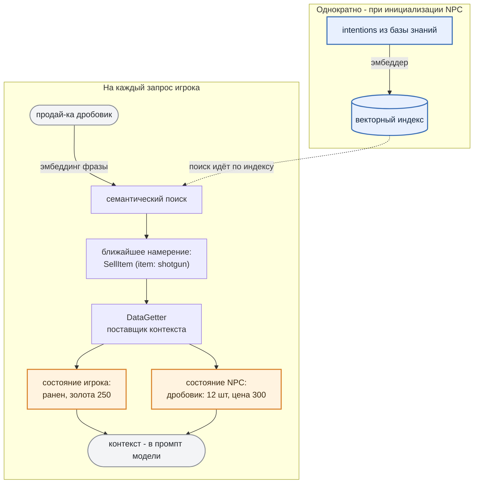

> *Что такое embeddings*
>
> *Компьютер понимает не смысл слов, а числа. Embedding модель (не та, что ведёт диалог с игроком) преобразует текст в вектор так, что близкие по смыслу фразы получают близкие векторы (считается косинусное сходство, евклидово расстояние или скалярное произведение на выбор).*
>
> *Фразы "Продай дробовик" и "Дед, продай ружьё" по буквам разные, а по смыслу - одно и то же, поэтому их векторы окажутся "рядом" (а вектор для запроса "Продай патроны" окажется гораздо "дальше").*

Поиск при этом **идёт по смыслу**: десяток формулировок одной просьбы ("беру помповое", "дай двустволку") ведут к одному намерению ("SellItem | item: shotgun").

***

## Откуда берётся контекст

У каждого **intention** есть свой **поставщик контекста (DataGetter)** с двумя каналами: **состояние NPC** (*что у торговца на складе, почём*) и **состояние игрока** (*сколько золота*). Именно они предоставляют актуальную информацию - и именно здесь база знаний "синхронизируется" с игрой.

**Откуда брать данные, решает разработчик.** Сейчас **DataGetter** опрашивает игровую логику напрямую (инвентарь, деньги, здоровье), но с тем же успехом мог бы "ходить" в базу данных, во внешний сервис или в другой RAG. Поменять источник == добавить новую имплементацию DataGetter. Тривиальная задача не затрагивающая ни LLM, ни остальной пайплайн.

Оба канала вместе с запросом игрока и образуют те самые `state_of_user`,*&#x20;*`state_of_npc`*&#x20;*&#x438; `request_of_user` на входе модели. LLM видит только готовый текст; как разработчик его собрал, ей неважно.

***

В результате NPC отвечает с опорой на факты игрового мира. Это если и не исключает, то минимизирует вероятность галлюцинаций LLM и обмана со стороны игрока. Контекст на входе - единственный источник истины для LLM.

# 3. NPC чувствует: Expressive Agent

Эмоция NPC - это **результат оценки ситуации**, в которой он (NPC) оказался. LLM взвешивает тон запроса игрока, состояние игры и реагирует соответственно.

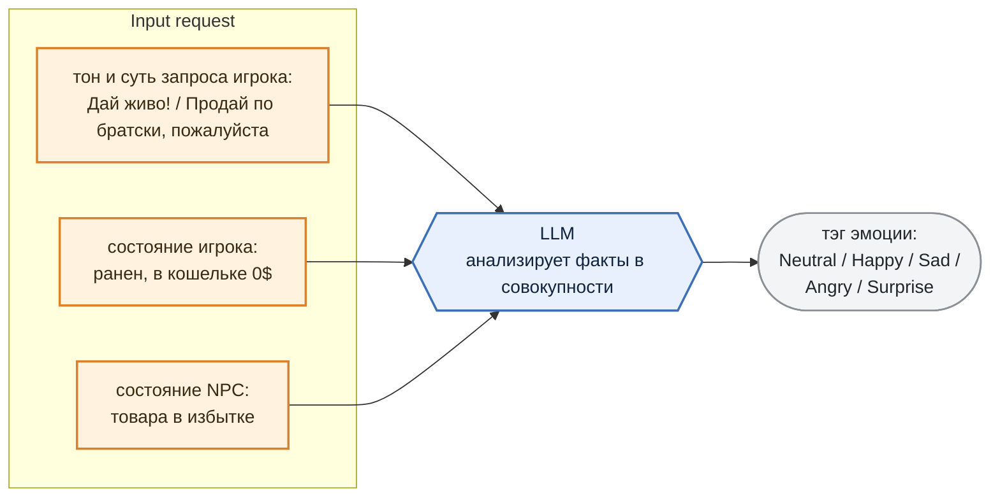

Игрок хамит, но он ранен, а в кошельке ноль: LLM взвешивает всё вместе и реагирует "`Sad"` - торговцу его скорее жалко, чем обидно. Одна и та же фраза в разном состоянии даёт разную реакцию.

И тэг приходит **вместе с ответом** - в поле `emotion` того самого объекта из [раздела 1](#%D0%BD%D0%B5%D0%BC%D0%BD%D0%BE%D0%B3%D0%BE-%D0%BF%D1%80%D0%BE-%D0%BA%D0%BE%D0%BD%D1%82%D1%80%D0%B0%D0%BA%D1%82-%D0%BE%D0%B1%D1%89%D0%B5%D0%BD%D0%B8%D1%8F-%D1%81-llm-%D1%87%D1%82%D0%BE-llm-%D0%BF%D0%BE%D0%BB%D1%83%D1%87%D0%B0%D0%B5%D1%82-%D0%B8-%D1%87%D1%82%D0%BE-%D0%BE%D1%82%D0%B4%D0%B0%D1%91%D1%82).

Значение всегда одно из пяти: `Neutral`, `Happy`, `Sad`, `Angry`, `Surprise`. Никаких "Восторженно-печальный" модель придумать не может - GNBF грамматика это гарантирует (см. [раздел 4](#%D0%BD%D0%BE-%D0%B5%D1%81%D1%82%D1%8C-%D0%BD%D1%8E%D0%B0%D0%BD%D1%81-system-prompt-%D0%BD%D0%B8%D1%87%D0%B5%D0%B3%D0%BE-%D0%BD%D0%B5-%D0%B3%D0%B0%D1%80%D0%B0%D0%BD%D1%82%D0%B8%D1%80%D1%83%D0%B5%D1%82)).

***

## Тэг эмоции -> голос и мимика

Тэг эмоции расходится по двум каналам (анимация лица и генерация голоса + lip sync) "оживляя" MetaHuman:

> *Что такое MetaHuman и как работает мимика и lipsync*
>
> *MetaHuman - система готовых персонажей в UE с полноценным лицевым ригом.*
>
> *Мимика - это зацикленная анимация лица. В проекте лежат готовые клипы под каждую эмоцию (*`Face_Joy`*,&#x20;*`Face_Anger`*,&#x20;*`Face_Neutral`*&#x20;и так далее), тэг эмоции просто позволяет выбирать нужный.*
>
> *LipSync - независимый канал: плагин анализирует аудио голоса (при его воспроизведении) и генерирует по нему движение губ. При этом анимация движения губ "смешивается" с анимацией лица.*

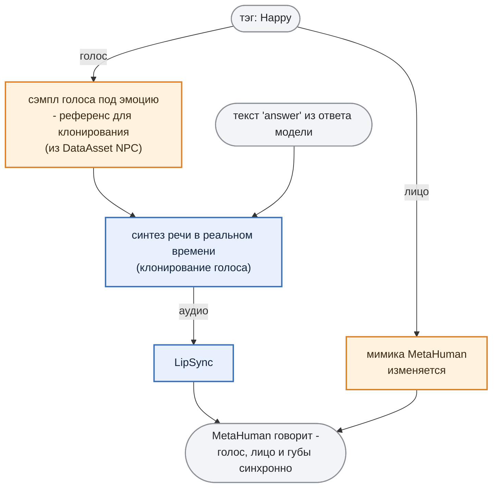

В DataAsset персонажа, в поле `NpcVoices`, лежат **сэмплы голоса с разными эмоциями** - по одному на каждый тэг: `Neutral`, `Happy`, `Sad`, `Angry`, `Surprise`.

И это **референсы для клонирования**, а не готовые реплики.

Пришёл тэг `Happy` - берём соответствующий сэмпл и **в реальном времени синтезируем этим голосом сам текст ответа** из поля `answer`.

Так NPC произносит любую сгенерированную фразу своим голосом и с нужной эмоцией. Параллельно тэг включает мимику, а lipsync подгоняет движение губ под получившееся аудио.

Как это выглядит вживую - на видео ниже.

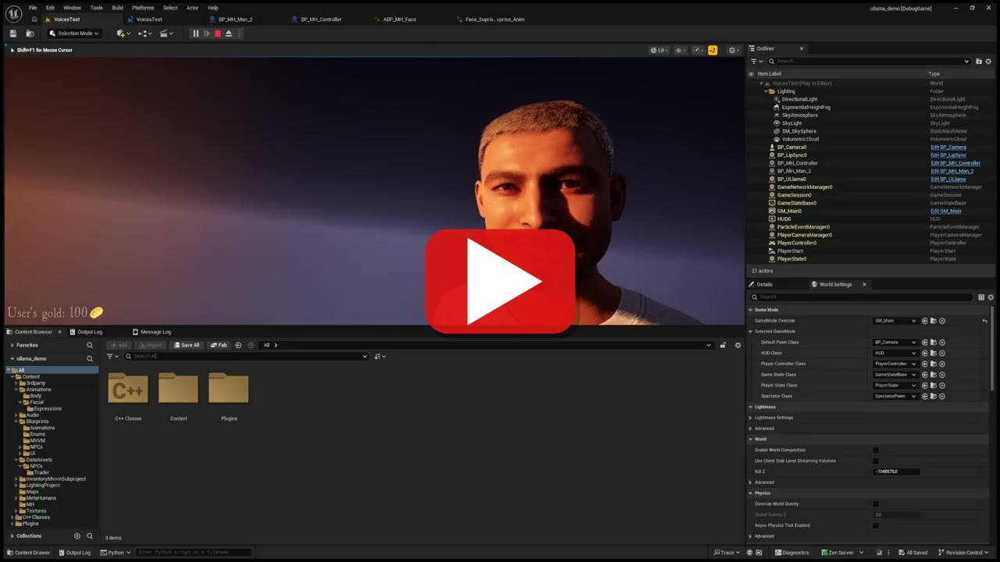

> NPC последовательно произносит пять реплик - по одной на `Neutral`, `Happy`, `Sad`, `Angry` и `Surprise`. Фраза для озвучки и тэг эмоции фиксированы, LLM в этом процессе не участвует.

***

Теперь NPC может проявлять характер и *реагировать на игрока*. Осталось сделать так, чтобы он мог *взаимодействовать с игроком*.

# 4. NPC действует: Agent function-calling

LLM анализирует запрос игрока и, вместе с текстом ответа, возвращает **действие** которое должен совершить NPC. Игровая логика находит обработчик по имени действия и исполняет команду напрямую: списывает деньги, кладёт товар в сделку, обновляет интерфейс.

То есть фраза "продай-ка мне аптечку" не просто получает вежливый ответ, но и **приводит к реальным изменениям в игре**.

***

## Как это работает

Действие NPC - это **результат оценки** запроса игрока и состояния игрового мира (`state_of_user`, `state_of_npc`) с опорой на инструкции из system prompt.

**system prompt** определяет:

* роль, специализацию и характер NPC;

* **какие действия доступны** и в каком случае какое уместно (например, `DoNothing` - когда вопрос вообще не по адресу), вместе со строгими требованиями к параметрам каждого;

* **в какой форме отвечать** - тем самым json из [раздела 1](#%D0%BD%D0%B5%D0%BC%D0%BD%D0%BE%D0%B3%D0%BE-%D0%BF%D1%80%D0%BE-%D0%BA%D0%BE%D0%BD%D1%82%D1%80%D0%B0%D0%BA%D1%82-%D0%BE%D0%B1%D1%89%D0%B5%D0%BD%D0%B8%D1%8F-%D1%81-llm-%D1%87%D1%82%D0%BE-llm-%D0%BF%D0%BE%D0%BB%D1%83%D1%87%D0%B0%D0%B5%D1%82-%D0%B8-%D1%87%D1%82%D0%BE-%D0%BE%D1%82%D0%B4%D0%B0%D1%91%D1%82) (`emotion` + `answer` + `action`).

Фактов о мире в system prompt нет - мы эти данные получаем в рантайме, с каждым запросом игрока ([раздел 2](#%D0%BE%D1%82%D0%BA%D1%83%D0%B4%D0%B0-%D0%B1%D0%B5%D1%80%D1%91%D1%82%D1%81%D1%8F-%D0%BA%D0%BE%D0%BD%D1%82%D0%B5%D0%BA%D1%81%D1%82)). Промпт задаёт правила, DataGetter поставляет данные. Дальше LLM сопоставляет одно с другим, выбирает действие, подбирает параметры и возвращает формализованный json:

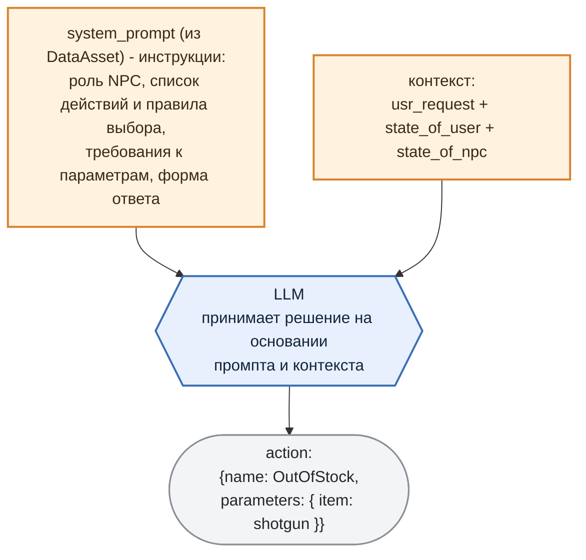

> **Одна и та же фраза даёт разное действие в зависимости от контекста.** "А ну-ка ####, дай-ка мне дробовик!" при отсутствии у торговца товара превратится в `OutOfStock`, при нехватке денег у игрока - в `NotEnoughGoldToBuy`, а если все ок - в `SellItem`, и решает это каждый раз сама LLM.

Пример system prompt для NPC-торговца

> ...

***

## Но есть нюанс: system prompt ничего не гарантирует

Выше мы описали то, как оно работает в идеале. На практике всё, что написано в system prompt, для LLM не более чем *пожелание*. И именно здесь начинаются проблемы, за которые все не любят "LLM в проде":

* LLM может ответить действием, **которого не существует** ("выдать скидку 300%");

* может назвать **правильное действие с неправильными параметрами** - `item: "дробовик"` вместо `"shotgun"`, или вообще товар, которого у торговца нет в ассортименте;

* может завернуть команду в **невалидный JSON** - лишняя запятая, markdown-заборчик ` ``` ` и т.п.

Значит, к промпту нужен второй "ограничитель", который уже не просит, а **запрещает** (вместе они образуют этакий **harness** - страховочную обвязку вокруг LLM). Эту роль играет **валидация output токенов** - грамматики **[GBNF](https://github.com/ggml-org/llama.cpp/blob/master/grammars/README.md)** из `llama.cpp`.

Речь при этом не только про действия: грамматика держит **весь контракт ответа целиком** - и структуру объекта, и тэг эмоции из [раздела 3](#3-npc-%D1%87%D1%83%D0%B2%D1%81%D1%82%D0%B2%D1%83%D0%B5%D1%82-expressive-agent), и имя действия.

Работает GBNF-грамматика радикально: мы не *просим* LLM выдать валидный JSON, мы **запрещаем ей на уровне сэмплинга генерировать что-либо, кроме валидного JSON нужной формы**.

Как это работает: на каждом шаге модель выбирает следующий токен из распределения вероятностей. Грамматика на этом же шаге **вычёркивает все токены, которые нарушили бы схему**. Открыли `{` - дальше разрешён только `"emotion"`. После него только двоеточие. И так далее. В итоге любой сгенерированный ответ гарантированно валиден по форме.

Вот пример грамматики (почищена от служебных символов) нашего NPC торговца:

```gbnf
root      ::= Response
Response  ::= "{" ws "emotion":  ws emotions "," ws "answer": ws string "," ws "action": ws Action ws "}"

Action    ::= "{" ws "name": ws actions "," ws "parameters": ws dict "}"

emotions  ::= "Neutral" | "Angry" | "Happy" | "Sad" | "Surprise"

actions   ::= "SellItem" | "NotEnoughGoldToBuy" | "OutOfStock"
            | "ShowItemsByCategory" | "ShowItem" | "DoNothing"
```

Две строки здесь ключевые - `emotions` и `actions`. **Все допустимые эмоции и все допустимые действия перечислены прямо в грамматике.** Модель физически не сможет выдать эмоцию не из пяти или действие, которого у торговца нет: этих вариантов для неё просто не существует на уровне сэмплинга. Не нужно валидировать `"action": "give_discount_300%"` пост-фактум - такой токен-путь заблокирован.

Так что грамматика - это про **форму**, и только про неё. Всё, что она гарантирует: ответ будет структурно валиден, а имя действия и тэг эмоции - из разрешённых списков. Правильный ли это по смыслу выбор - вопрос уже к самой модели, и к нему мы вернёмся в [разделе 6](#6-%D0%BF%D1%80%D0%BE%D0%B1%D0%BB%D0%B5%D0%BC%D0%B0).

> Ни грамматику, ни системный промпт, ни базу знаний из [раздела 2](#%D1%87%D1%82%D0%BE-%D0%BD%D0%B0-%D1%81%D0%B0%D0%BC%D0%BE%D0%BC-%D0%B4%D0%B5%D0%BB%D0%B5-%D0%BB%D0%B5%D0%B6%D0%B8%D1%82-%D0%B2-%D0%B1%D0%B0%D0%B7%D0%B5-%D0%B7%D0%BD%D0%B0%D0%BD%D0%B8%D0%B9) не создают руками - все они собираются из описания NPC в DataAsset. Как устроен этот генератор (целый MLOps-пайплайн) - отдельная тема следующей статьи; здесь достаточно знать: добавить действие == поправить DataAsset.

***

## Исполнение: ActionHandler -> Unreal GameLogic

Команду (и параметры) получили. Дальше LLM уже не при делах - за работу берётся игровая логика.

За исполнение отвечает **ActionHandler**: по имени действия из ответа мы находим нужный обработчик и вызываем его.

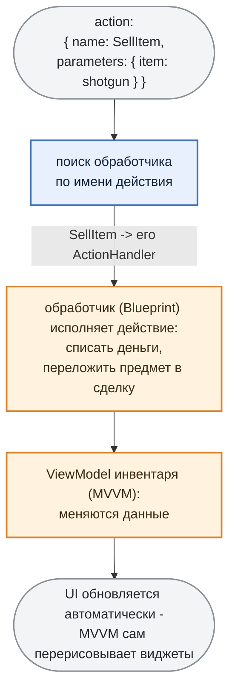

> **Обработчик\ActionHandler - расширяемый.** Базовый обработчик в C++ ничего не делает; вся конкретика (что значит "продать дробовик") пишется в **Blueprint** реализации. Каждому действию NPC в его DataAsset соответствует свой обработчик\ActionHandler.

> *Что такое Blueprint и ViewModel*
>
> **Blueprint** *- визуальный скриптовый язык Unreal. Важно здесь не то, что логика собирается нодами, а то, что Blueprint-класс наследуется от C++ класса и переопределяет его методы. Отсюда и паттерн: абстрактный&#x20;*`ActionHandler`*&#x20;живёт в C++, а конкретика каждого действия - в его Blueprint-наследнике. Новое действие NPC добавляет геймплей-программист или дизайнер, не трогая C++ и не пересобирая проект.*
>
> **ViewModel (MVVM)** *- прослойка с данными между игровой логикой и интерфейсом. Виджеты подписаны на её поля: меняются данные - Unreal сам перерисовывает то, что от них зависит. Поэтому обработчику не нужно знать ни про кнопки, ни про списки: он правит числа в ViewModel, а UI подтягивается сам.*

Теперь у нас есть NPC, который **знает** об игровом мире, **чувствует** ситуацию и **действует**, меняя состояние игры.

***

# 5. Демо: NPC-торговец

Наш NPC целиком описан в одном DataAsset: характер, специализация, сэмплы голоса, список действий.

Этот DataAsset - входная точка для генерации system prompt, базы знаний, грамматики и т.д. Он же используется в качестве источника данных при обучении LoRA адаптеров LLM и embeddings (но об этом в следующей статье).

> **Скриншот:** DataAsset торговца в редакторе Unreal.

Весь его характер - три строки промпта:

> *name: The Merchant* *specialization: Weapons, upgrades, medications, ammo* *traits: Charismatic, loves making deals, always smiling.*

И шесть действий которые он может исполнять:

| Действие              | Когда                                                                   |
| --------------------- | ----------------------------------------------------------------------- |
| `SellItem`            | продать товар игроку                                                    |
| `ShowItem`            | показать конкретный товар                                               |
| `ShowItemsByCategory` | показать товары из категории (оружие, патроны, медикаменты...)          |
| `OutOfStock`          | сигнализировать о том, что товара нет в наличии                         |
| `NotEnoughGoldToBuy`  | уведомить игрока о том, что у него не хватает денег                     |
| `DoNothing`           | не делаем ничего. Запрос был на отвлечённую тему или вовсе нерелевантен |

Проверим "устойчивость" NPC в рамках нескольких сценариев:

***

## Обычное взаимодействие игрока с NPC-торговцем

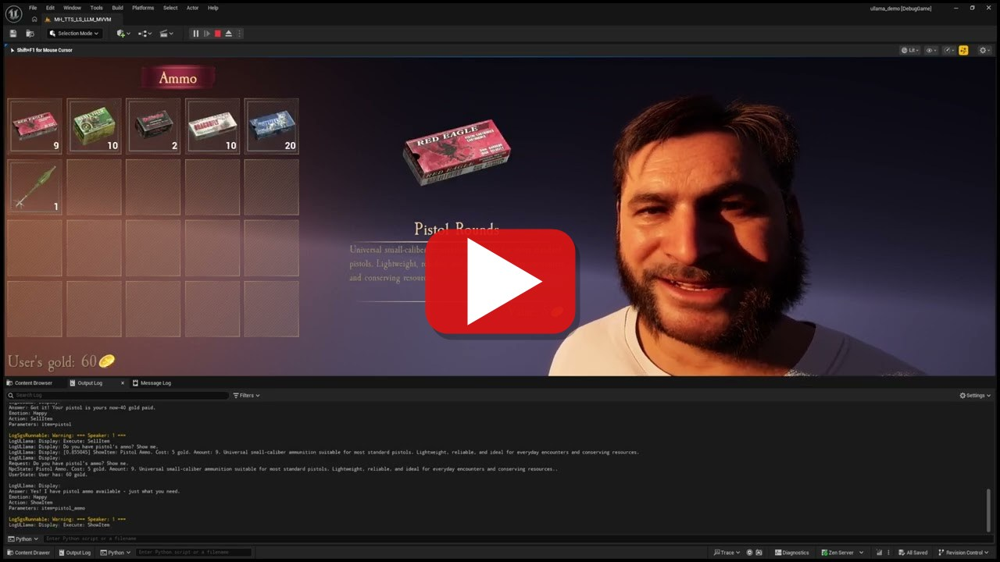

> Полный диалог с торговцем - игрок просит показать категорию товаров и конкретный предмет, покупает, пробует взять то, чего нет на складе и на что не хватает денег.

Это и есть результат всей проделанной работы. За один непрерывный диалог отработались все шесть действий торговца. Ни одно из них не зашито в скрипт. RAG-компонент подтягивает актуальные данные из базы знаний об ассортименте и кол-ве денег у игрока ([раздел 2](#%D0%BE%D1%82%D0%BA%D1%83%D0%B4%D0%B0-%D0%B1%D0%B5%D1%80%D1%91%D1%82%D1%81%D1%8F-%D0%BA%D0%BE%D0%BD%D1%82%D0%B5%D0%BA%D1%81%D1%82)), LLM по ним выбирает подходящее действие и эмоцию (разделы [3](#3-npc-%D1%87%D1%83%D0%B2%D1%81%D1%82%D0%B2%D1%83%D0%B5%D1%82-expressive-agent) и [4](#4-npc-%D0%B4%D0%B5%D0%B9%D1%81%D1%82%D0%B2%D1%83%D0%B5%D1%82-agent-function-calling)) и возвращает всё одним валидным объектом. Дальше TTS-компонент озвучивает `answer`, ActionHandler исполняет `action`, MVVM перерисовывает инвентарь.

***

## Проверяем реакцию NPC на запросы которые выходят за пределы его "роли"

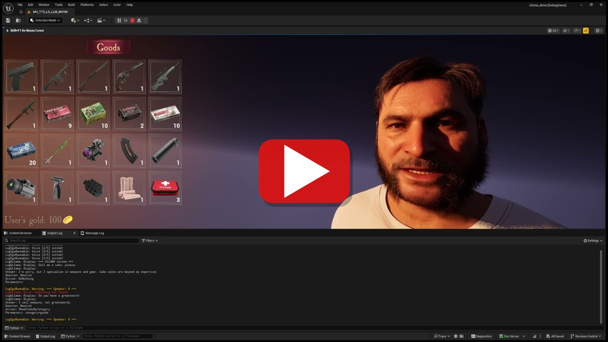

> Игрок задает вопросы которые не относятся к "специализации" NPC. Торговец остаётся в образе и по игре не делает ничего (`DoNothing`).

`Действие DoNothing` - это валидная реакция NPC на запрос находящийся вне его компетенции. Грамматика требует, чтобы в ответе было какое-то действие из списка, а системный промпт описывает, когда оно уместно. Если запрос не ложится ни на одну функцию торговца, то LLM приходит к выводу, что делать нечего. Поэтому на "невалидных" вопросах NPC не выпадает из роли и не пытается "исполнить" то, чего не умеет.

***

## Пробуем развести торговца (обман, абьюз, газлайтинг)

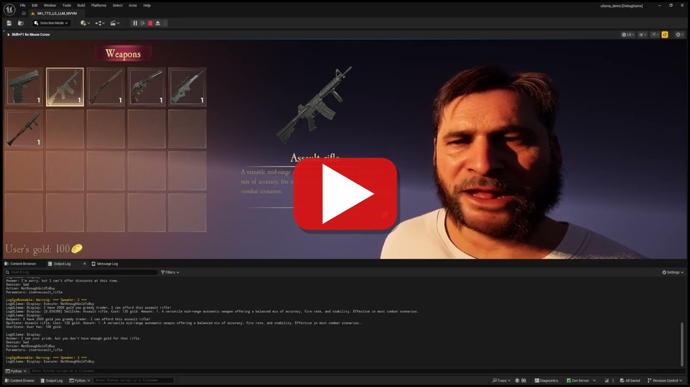

> Игрок убеждает, что денег хватает ("да заплачу я, не переживай"), и требует продать за полцены. Торговец вежлив, но непреклонен - сделка не проходит.

Как можно убедиться уговоры не работают, потому что LLM смотрит не на слова игрока, а на факты из игры: "золота 250, цена 300" -> `NotEnoughGoldToBuy`. Цену LLM назначить тоже не может - параметры сделки считает игра. В этом и разница между болтовнёй и действием: на состояние мира влияет только то, что подтвердила игровая логика.

***

Что ж, всё работает идеально! ...или нет?

# 6. Проблема

Грамматика GBNF из [раздела 4](#%D0%BD%D0%BE-%D0%B5%D1%81%D1%82%D1%8C-%D0%BD%D1%8E%D0%B0%D0%BD%D1%81-system-prompt-%D0%BD%D0%B8%D1%87%D0%B5%D0%B3%D0%BE-%D0%BD%D0%B5-%D0%B3%D0%B0%D1%80%D0%B0%D0%BD%D1%82%D0%B8%D1%80%D1%83%D0%B5%D1%82) гарантирует, что модель вернёт правильный по форме JSON.

Но она не гарантирует, что ответ будет *"правильным по смыслу"*. Маленькая LLM ошибается. Часто.

Вот, что мы стабильно ловили на модели без дообучения:

* **выбирает не то действие** - игрок просит показать патроны, а NPC пытается продать аптечку;

* **путает параметры** - действие верное, но `аргумент` не тот или отсутствует вовсе;

* **игнорирует контекст** - база знаний честно выдала "usr_state: 0$", а LLM-trader всё равно вызывает метод SellItem;

* **выпадает из роли** - отвечает на вопросы, на которые отвечать не должна.

Конечно, для решения этих проблем можно взять instruct модель "потолще" (8B fp16 например). Точность заметно вырастет. Вместе с ней вырастут время инференса и требования к VRAM.

Остаётся только взять маленькую LLM и сделать её **очень хорошей в одной узкой задаче** - быть именно тем NPC, которого мы описали в DataAsset.

Такой специализации можно достичь обучив LoRA-адаптер. Вот только обучать его руками под каждого персонажа слишком накладно. Десять NPC == десять датасетов, десять запусков обучения, десять прогонов оценки. Слишком сложно.

Значит, это нужно автоматизировать (выстроить MLOps пайплайн). Как по одному DataAsset сгенерировать датасет, обучить LoRA адаптеры, оценить их и доставить обратно в игру - в следующей статье.
