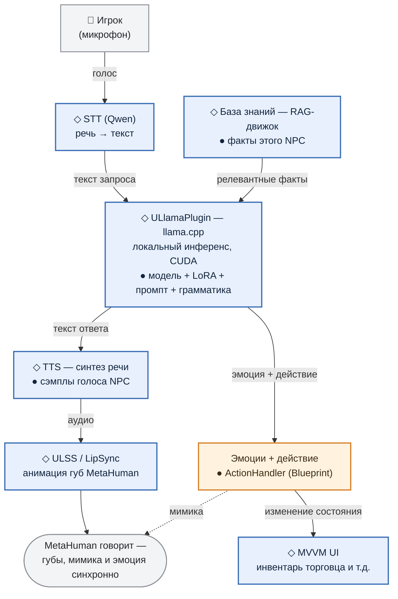

# Раздел 1. С высоты птичьего полёта

> Черновик для статьи (часть 2). Задача раздела — дать читателю карту целиком, чтобы дальше можно было нырять в детали, не теряя контекст.

---

## 1.1. Что не так было с PoC

- **NPC статичен** — он ничего не знает об игровом мире и, как следствие, выдумывает факты на ходу. Спросите NPC-торговца, есть ли у него плюмбус и почём, — и NPC, глазом не моргнув, выразит готовность его продать и даже назовёт цену.
- **NPC не может влиять на игровой мир** — только говорить. Нельзя было попросить «продай пистолет, пожалуйста» и получить ствол в инвентарь, потратив при этом деньги.
- **NPC эмоционально плоский** — один голос, одно выражение лица на любую реплику игрока (какой бы хамской она ни была).

---

## 1.2. Что мы с этим сделали

- **Agent knowledge base** — база знаний (RAG) для NPC, синхронизированная с игровым миром. NPC анализирует запрос игрока, извлекает из БЗ факты и отвечает игроку в соответствии с ними.
- **Agent function-calling** — NPC анализирует запрос игрока, выбирает действие (из заданного списка) и возвращает его вместе с ответом; игровая логика вызывает ActionHandler.
- **Expressive Agent** — NPC анализирует тональность запроса игрока (не хамит ли), состояние игрока (не ранен ли) и собственное состояние и вместе с текстовым ответом возвращает тэг эмоции, соответствующий ситуации. Этот тэг определяет, какую анимацию лица (MetaHuman) применить и какой сэмпл голоса использовать для клонирования при преобразовании текста в речь (TTS).

Так говорящая голова перестаёт быть просто головой: NPC знает свой мир, проявляет характер и влияет на игру.

---

## 1.3. Схема работы

Весь путь одной реплики игрока — от микрофона до реакции игры. Заодно пометим, что в этой трубе **общее для всех NPC** (◇ каркас), а что **своё у каждого** (● из его DataAsset):

> ◇ — **каркас**, один на всех NPC ● — **сменное**, из DataAsset этого NPC

> **TODO для вёрстки:** проверить, как Хабр отрисует mermaid; если рендер подведёт — экспортировать в SVG. При желании дополнительно подсветить колонны «живёт» (RAG + эмоции) и «действует» (действие + UI).

На схеме видно, что есть общая для всех типов NPC часть: распознавание и синтез речи, lip sync для MetaHuman, инференс LLM (базовая модель к тому же грузится в память один раз на всех — десять NPC делят одну, а не тянут десять копий).

А всё, что делает торговца именно торговцем (т.е. его персоналия), — берётся из его `DataAsset`: описание характера, LoRA-адаптер, сэмплы голоса и логика действий (ActionHandler / DataGetter).

Ответ на главный вопрос роста прост: добавить нового NPC — это заполнить поля в DataAsset. Не надо переписывать движок. **Персонаж становится контентом, а не кодом.**

И ещё одно, общее для всей схемы: весь этот пайплайн работает **локально** — приватность, никакой сетевой задержки и платы за токены.

Далее разберём каждый компонент этой системы по отдельности.

---

## Заметки автора (не для публикации)

- STT: считаем, что распознавание реализовано на **Qwen-STT** (в части 1 был Vosk). В коде проекта самого STT-модуля нет — при необходимости описать его как внешний/отдельный компонент.
- Схема 1.3 переведена из ASCII в **mermaid** (`flowchart TD`). Разметка каркас (◇) / сменное (●) продублирована дважды: значками в подписях нод и цветом через `classDef` (frame — синий, swap — оранжевый), чтобы читалось и в ч/б. Легенда — строкой-цитатой под схемой. Проверить рендер mermaid на Хабре; если не поддержится — экспортировать в SVG.
- В mermaid-схеме добавлена пунктирная стрелка «мимика» от блока эмоций к финальной ноде MetaHuman — в ASCII-версии её не было, хотя подпись про «губы, мимика и эмоция» подразумевала. Согласовано с разделом 3 (тэг эмоции управляет мимикой); держится на том же факт-чеке.
- Таблицу-оглавление (боль → решение → раздел) убрали по просьбе автора: 1.2 теперь прозой (Agent KB / function-calling / эмоции), а навигацию закрывает финальная фраза 1.3 «далее разберём каждый компонент». Если вернём таблицу — синхронизировать с разделами 2–4.
- Архитектура (каркас + сменная часть) НЕ выделена в отдельный подпункт: нанесена прямо на схему 1.3 значками ◇/●. Пришла из бывшего отдельного раздела «архитектура» (был №7 до перенумерации). Детали — в разделах 2–4. Имена API (`UNPCDataAsset`, `UNPCDataRegistry`, `UULlamaActionHandlerBase`, `UKnowledgeBaseDataGetterBase`) в тексте не приводим — при желании добавить сноской.
- Разметка ◇/● на схеме: движки — каркас; данные и BP-логика конкретного NPC — сменное. ULlamaPlugin помечен и как ◇ (движок общий), и внутри как ● (модель/LoRA/промпт/грамматика — из DataAsset); если при вёрстке двойная метка мешает — оставить движок ◇, а сменное показать входящей стрелкой от DataAsset.
- Разделяемая модель с подсчётом ссылок — `FULlamaModelRegistry` в `ULlamaManager.cpp` (Acquire/Release, ключ `ModelFilePath|Lora|GpuLayers|NCtx`). Подана мельком.
- «Плюмбус» (1.1) — намеренно вымышленный товар (отсылка к Rick & Morty) как пример факта, которого нет в мире; при желании заменить на нейтральный несуществующий предмет.
- Имена компонентов (1.2): `Agent knowledge base` (RAG), `Agent function-calling`, `Expressive Agent`. Порядок слов у третьего инвертирован относительно первых двух — оставлено по выбору автора; при желании выровнять в единый шаблон (`Agent …` или `… Agent`).
- Факт-чек: реально ли в проекте сейчас больше одного NPC, или второй — гипотетический. Формулировка «сменная часть под каждого NPC» работает в обоих случаях.
