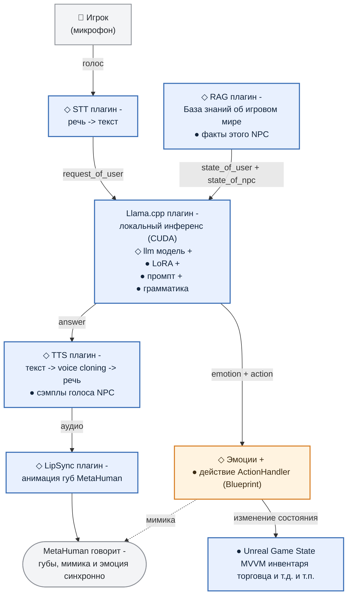

# 1. Общая картина

***

## Что не так было с PoC

* **NPC статичен** - он ничего не знает об игровом мире и, как следствие, выдумывает факты на ходу. Спросите NPC-торговца, есть ли у него плюмбус, и NPC, глазом не моргнув, выразит готовность его продать и даже назовёт цену.

* **NPC не может влиять на игровой мир**. Нельзя было попросить "продай пистолет, пожалуйста" и получить ствол в инвентарь, потратив при этом деньги.

* **NPC эмоционально плоский**. Один голос, одно выражение лица на любую реплику игрока (какой бы хамской она ни была).

***

## Что мы с этим сделали

Каждый из недочётов PoC мы закрыли своим механизмом:

* **Agent knowledge base** ([раздел 2](https://github.com/MimusTriurus/ullama_demo/blob/master/docs/parts/section-02-knowledge.md)) - база знаний (по принципам RAG) для NPC, синхронизированная с игровым миром. NPC анализирует запрос игрока, извлекает из БЗ факты и отвечает игроку в соответствии с ними.

* **Expressive Agent** ([раздел 3](https://github.com/MimusTriurus/ullama_demo/blob/master/docs/parts/section-03-emotions.md)) - NPC анализирует тональность запроса игрока (не хамит ли), состояние игрока (не ранен ли), собственное состояние и вместе с текстовым ответом возвращает тэг эмоции, соответствующий ситуации. Этот тэг определяет, какую анимацию лица (MetaHuman) применить и какой сэмпл голоса использовать для клонирования при преобразовании текста в речь.

* **Agent function-calling** ([раздел 4](https://github.com/MimusTriurus/ullama_demo/blob/master/docs/parts/section-04-function-calling.md)) - NPC анализирует запрос игрока, выбирает действие (из заданного списка) и возвращает его вместе с ответом; игровая логика выполняет действие.

Так NPC перестаёт быть просто говорящим болванчиком: он опирается на реальное состояние мира и способен на это состояние влиять.

***

## Схема работы



На схеме мы выделили общую для всех типов NPC часть (◇) (распознавание и синтез речи, lip sync для MetaHuman, инференс LLM) и часть которая касается конкретного NPC (●).

Все что относится непосредственно к персоналии NPC (*описание характера, сэмплы голоса под каждую эмоцию и набор действий (blueprint handlers) которые ему доступны в игре*) хранится в Unreal Data Asset .

> *Что такое DataAsset*
>
> *Ассет-контейнер данных в Unreal: набор полей и никакой логики. Заводится в редакторе, лежит в контенте рядом с моделями и звуками, версионируется вместе с ними, правится дизайнером без участия программиста и без пересборки проекта.*

Т.о. чтобы добавить нового NPC, достаточно заполнить соответствующие поля в DataAsset.

***

## На чём это работает

Каркас системы (◇ на схеме) собран из четырёх плагинов - все они опубликованы нами на Fab:

* **[ULlama](https://www.fab.com/listings/191b86f7-650d-4af8-a6dc-88f753e05968)** - инференс LLM внутри движка поверх `llama.cpp` с ускорением на CUDA. Этот плагин отвечает за работу как диалоговой модели (**Qwen3.5 2B в fp16**) так и embedding модели (**Qwen3-Embedding**) обеспечивающей семантический поиск по базе знаний ([раздел 2](https://github.com/MimusTriurus/ullama_demo/blob/master/docs/parts/section-02-knowledge.md));

* **[SRS](https://www.fab.com/listings/96959d66-ab4a-4dc3-b416-385d46982bf8)** - распознавание речи игрока (STT), на модели **Qwen-STT**;

* **[SGS](https://www.fab.com/listings/82bb7c8a-7d09-4046-a0a1-dfb6ae412c8c)** - синтез речи с клонированием голоса (TTS), на модели **Qwen-TTS**;

* **[ULSS](https://www.fab.com/listings/d7fb5d8e-478f-49c7-b09c-3c36147ce4b4)** - анимация губ MetaHuman по аудио (LipSync).

Все работает локально. Никаких внешних API, платы за токены и GDPR. Правда у всего есть цена...

***

## Насколько такая система требовательна к железу

Главное, что нужно понимать про нагрузку: на видеокарте одновременно живут **четыре нейронки** - диалоговая LLM, модель эмбеддингов для базы знаний, STT и TTS модели. И всё это - вдобавок к самой игре.

По факту демо занимает примерно **13 ГБ** видеопамяти. То есть практическое требование - **карта уровня RTX 5070 Ti с 16 ГБ VRAM**.

Влезть в карту поскромнее можно: `llama.cpp/gguf` умеет держать часть слоёв модели на GPU, а часть считать на CPU. Требование по VRAM смягчается, но каждый вынесенный слой добавляет к задержке и пауза между вопросом игрока и ответом NPC превращается в неловкое молчание.

Потребление видеопамяти моделями не зависит от количества NPC на уровне. Сами модели от NPC к NPC не меняются - они общие. Меняются только LoRA-адаптеры (именно они и добавляют NPC характер), а они не весят практически ничего.

Поэтому на сцене спокойно может находиться несколько NPC одновременно: каждый со своим характером, голосом и набором действий, но все - поверх одного набора моделей в VRAM.

***

## Немного про "контракт" общения с LLM. Что LLM получает и что отдаёт

**На входе** - три поля: сам запрос игрока (`request_of_user - результат STT преобразования`) плюс данные из игры: `state_of_user` и `state_of_npc (см. `раздел 2`)`:

```json
{
  "request_of_user": "покажи, что есть из оружия",
  "state_of_user":   "ранен, денег 250$",
  "state_of_npc":    "дробовик: 12 шт, цена 300$; пистолет: 3 шт, цена 150$"
}
```

**На выходе** - не свободный текст, а такой же строгий json объект:

```json
{
  "emotion": "Happy",
  "answer":  "Конечно, вот лучшие стволы в городе!",
  "action":  { "name": "ShowItemsByCategory", "parameters": { "category": "weapons" } }
}
```

Дальше, как показано на схеме, каждое поле уходит своим маршрутом: `answer` - в озвучку, `emotion` - в мимику MetaHuman и выбор сэмпла голоса ([раздел 3](https://github.com/MimusTriurus/ullama_demo/blob/master/docs/parts/section-03-emotions.md)), `action` - в игровую логику ([раздел 4](https://github.com/MimusTriurus/ullama_demo/blob/master/docs/parts/section-04-function-calling.md)).

Причём нарушить этот формат модель физически не может. И структура объекта, и допустимые значения `emotion` и `action` заданы **грамматикой на уровне сэмплинга** - как именно, разберём в [разделе 4](https://github.com/MimusTriurus/ullama_demo/blob/master/docs/parts/section-04-function-calling.md).

***

Далее разберём каждый компонент этой системы по отдельности.
