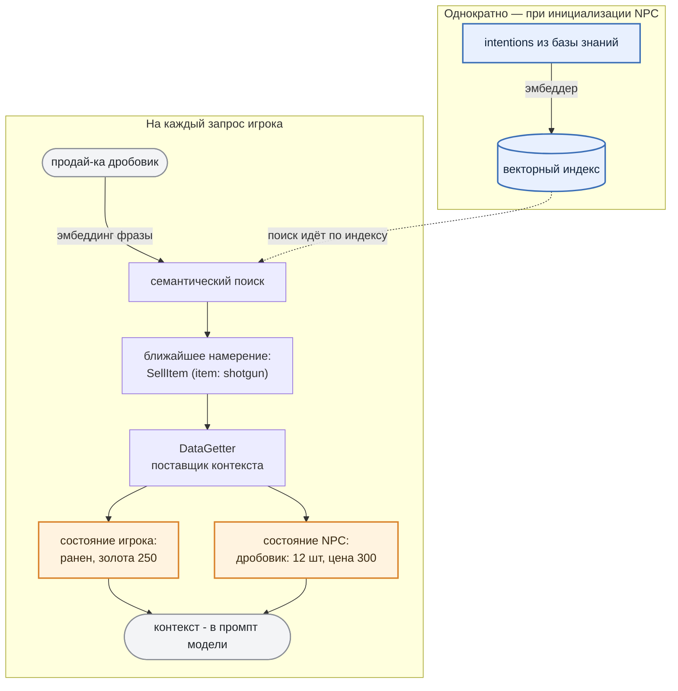

# 2. NPC знает: Agent knowledge base

Перед тем как отправить запрос игрока в LLM, мы анализируем этот запрос на предмет того, что игрок хочет от NPC, извлекаем из базы знаний NPC факты игрового мира и добавляем их к запросу.

Так LLM будет отвечать, опираясь на реальное состояние игры. Осталось разобраться, что мы называем "базой знаний", потому что устроена она не совсем так, как принято в классическом RAG.

***

## Что на самом деле лежит в базе знаний

Обычно RAG работает с документами: текст режут на фрагменты, складывают в векторную базу, а на запрос достают самые похожие куски и подмешивают их в промпт. Наша база устроена несколько иначе. Она **не хранит** информацию о мире игры. В ней лежат только **намерения игрока**.

Т.е. то, чего он добивается от NPC своим запросом. Каждое намерение - это сигнатура вида "действие + параметры" (поле **intention**) с привязкой к своему **поставщику контекста** (поле **action**):

```json
[
  { "intention": "SellItem | item: pistol",  "action": { "name": "SellItem",  "parameters": { "item": "pistol" } } },
  { "intention": "SellItem | item: shotgun", "action": { "name": "SellItem",  "parameters": { "item": "shotgun" } } }
]
```

> Поле **action** в данном случае - не то действие, которое NPC исполнит. Это лишь **ключ к поставщику контекста**: по нему мы понимаем, какие факты из игры вытащить для этого намерения. Какое действие совершить, решает LLM - она может ответить и `OutOfStock`, и `NotEnoughGoldToBuy` на то же самое намерение `SellItem`.

Почему так, а не "сложить в базу все факты": факты меняются в рантайме (товар купили, деньги потратили, игрока ранили). Хранить их копию в базе - значит гарантированно рассинхронизировать её с игрой. Поэтому база отвечает лишь на вопрос **"чего добивается игрок"**, а сами факты подтягиваются **из игрового состояния** в момент ответа. Так информация остается всегда актуальной.

***

## Как распознаётся намерение игрока

Один раз, при инициализации NPC, все намерения из базы прогоняются через embedding модель (поле **intention** из json выше) и преобразуются в векторный индекс. Дальше при каждом запросе игрока работает семантический поиск:



> *Что такое embeddings*
>
> *Компьютер понимает не смысл слов, а числа. Embedding модель (не та, что ведёт диалог с игроком) преобразует текст в вектор так, что близкие по смыслу фразы получают близкие векторы (считается косинусное сходство, евклидово расстояние или скалярное произведение на выбор).*
>
> *Фразы "Продай дробовик" и "Дед, продай ружьё" по буквам разные, а по смыслу - одно и то же, поэтому их векторы окажутся "рядом" (а вектор для запроса "Продай патроны" окажется гораздо "дальше").*

Поиск при этом **идёт по смыслу**: десяток формулировок одной просьбы ("беру помповое", "дай двустволку") ведут к одному намерению ("SellItem | item: shotgun").

***

## Откуда берётся контекст

У каждого **intention** есть свой **поставщик контекста (DataGetter)** с двумя каналами: **состояние NPC** (*что у торговца на складе, почём*) и **состояние игрока** (*сколько золота*). Именно они предоставляют актуальную информацию - и именно здесь база знаний "синхронизируется" с игрой.

**Откуда брать данные, решает разработчик.** Сейчас **DataGetter** опрашивает игровую логику напрямую (инвентарь, деньги, здоровье), но с тем же успехом мог бы "ходить" в базу данных, во внешний сервис или в другой RAG. Поменять источник == добавить новую имплементацию DataGetter. Тривиальная задача не затрагивающая ни LLM, ни остальной пайплайн.

Оба канала вместе с запросом игрока и образуют те самые `state_of_user`,*&#x20;*`state_of_npc`*&#x20;*&#x438; `request_of_user` на входе модели. LLM видит только готовый текст; как разработчик его собрал, ей неважно.

***

В результате NPC отвечает с опорой на факты игрового мира. Это если и не исключает, то минимизирует вероятность галлюцинаций LLM и обмана со стороны игрока. Контекст на входе - единственный источник истины для LLM.
