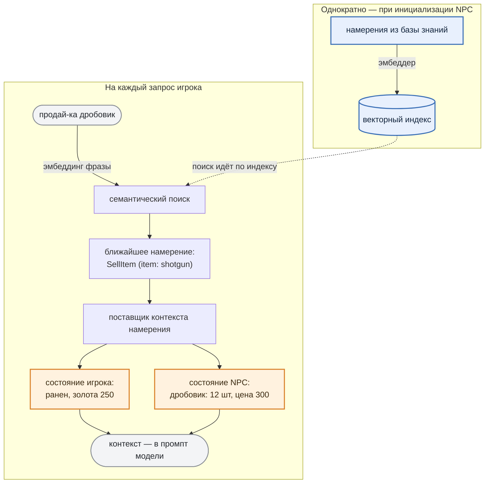

# 2. Agent knowledge base:

***

## Идея

Перед тем как отправить запрос игрока в LLM, мы анализируем этот запрос, извлекаем из базы знаний NPC факты игрового мира и добавляем их к запросу.

Так модель отвечает, опираясь на реальное состояние игры. Осталось разобраться, что мы называем "базой знаний", потому что устроена она не совсем так, как принято в класическом RAG.

***

## Что на самом деле лежит в базе знаний

Обычно RAG работает с документами: текст режут на фрагменты, складывают в векторную базу, а на запрос достают самые похожие куски и подмешивают их в промпт. Наша база устроена иначе — она **не хранит знаний о мире**, ни цен на предметы, ни списка квестов, ни лора. В ней лежат только **намерения игрока** — то, чего он добивается от NPC своим запросом (назовем это *intent*). Каждое намерение — это сигнатура вида "действие + параметры" с привязкой к своему **поставщику контекста**:

```json
[
  { "signature": "SellItem | item: pistol",  "action": { "name": "SellItem",  "parameters": { "item": "pistol" } } },
  { "signature": "SellItem | item: shotgun", "action": { "name": "SellItem",  "parameters": { "item": "shotgun" } } }
]
```

Почему так, а не "сложить в базу все факты": факты меняются в рантайме (товар купили, деньги потратили, игрока ранили). Хранить их копию в базе — значит гарантированно рассинхронизировать её с игрой. Поэтому база отвечает лишь на вопрос **"чего добивается игрок"**, а сами факты подтягиваются **живьём из игрового состояния** в момент ответа — и всегда актуальны.

***

## Как распознаётся намерение

Один раз, при инициализации NPC, все намерения из базы прогоняются через эмбеддер и превращаются в векторный индекс. Дальше на каждый запрос игрока работает семантический поиск:



> 💡 *Что такое эмбеддинги (для тех, кто не в теме)*
>
> *Компьютер понимает не смысл слов, а числа. ****Эмбеддинг**** превращает кусочек текста в вектор так, что близкие по смыслу фразы получают близкие векторы (считается *косинусное сходство, евклидово расстояние или скалярное произведение на выбор*).*
>
> *Фразы "Продай дробовик" и "Дед, продай ружье" по буквам разные, а по смыслу — одно и то же, поэтому их векторы окажутся "рядом" (а вектор для запроса "Продай патроны" окажется гараздо "дальше").*
>
> *Векторы считает отдельная маленькая модель-эмбеддер (не та, что ведёт диалог).*

Поиск при этом **идёт по смыслу**: десяток формулировок одной просьбы ("беру помповое", "дай двустволку") ведут к одному намерению ("SellItem | item: shotgun").

***

## Откуда берётся контекст

У каждого *intent* есть свой **поставщик контекста** с двумя каналами: **состояние NPC** (что у торговца на складе, почём) и **состояние игрока** (сколько золота). Именно они дают те самые "живые" факты — и именно здесь база "синхронизируется" с игрой.

**Откуда брать данные, решает разработчик.** Сейчас поставщик спрашивает игровую логику напрямую (инвентарь, деньги, здоровье), но с тем же успехом мог бы "ходить" в базу данных, во внешний сервис или в другой RAG. Поменять источник — локальная правка одного поставщика, не затрагивающая ни модель, ни остальной пайплайн.

***

## Что уходит в промпт LLM

Оба канала контекста вместе с самим запросом образуют вход модели:

```text
   request_of_user: "а дробовик есть?"
   state_of_user:   "ранен, денег 250"
   state_of_npc:    "дробовик: 12 шт, цена 300"
```

Модель видит только готовые строки; как разработчик их собрал, ей неважно.

***

В результате NPC отвечает к месту с опорой на факты игрового мира. Это если и не исключает, то минимизирует вероятность галюцинаций LLM и обмана со стороны игрока.

***
