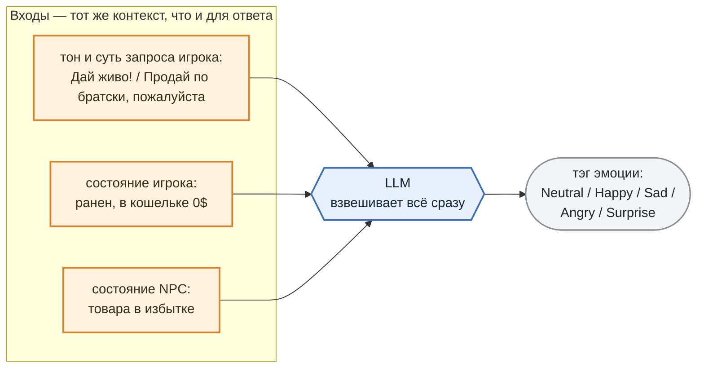
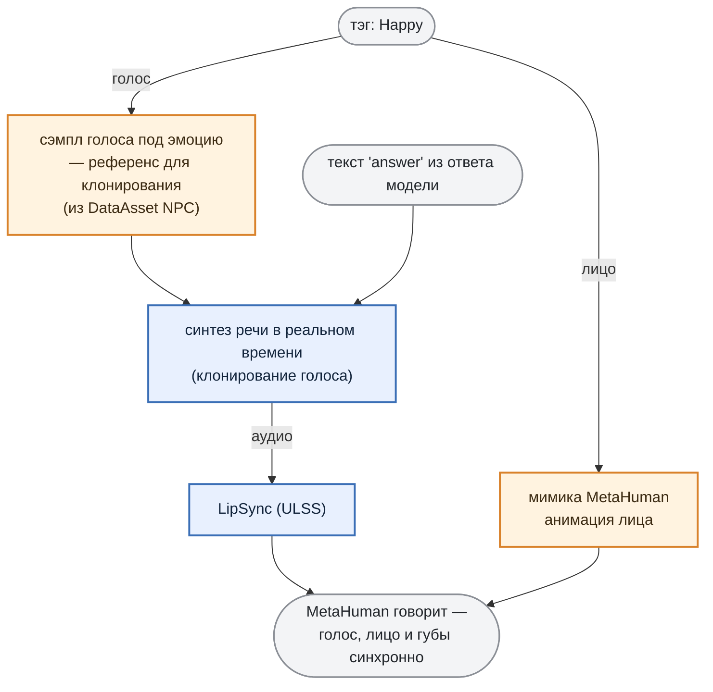

# 3. Expressive Agent

***

## Идея

Вместе с текстовым ответом LLM возвращает **тэг эмоции**. Этот тэг задаёт мимику MetaHuman и выбор голосового сэмпла для клонирования при синтезе речи.

Без этого NPC отвечает одинаково-ровно: одна интонация и одно выражение лица на любую реплику, будь то благодарность или хамство. Такой собеседник ощущается автоответчиком.

***

## Откуда берётся эмоция

Эмоция NPC — это **результат оценки ситуации**, в которой он оказался. LLM взвешивает тон запроса игрока, состояние игрока и NPC и реагирует соответственно.



Игрок хамит (`тон запроса`), но принёс редкий трофей (`состояние NPC`) да ещё и ранен (`состояние игрока`) — модель взвешивает всё вместе и может выдать `Surprise` вместо ожидаемого `Angry`. Один и тот же вопрос в разном состоянии даёт разную реакцию.

И тэг приходит **вместе с ответом**, одним структурированным объектом за один инференс (что заметно снижает время реакции):

```json
{
  "emotion": "Happy",
  "answer":  "Конечно, вот лучшие стволы в городе!",
  "action":  { "name": "ShowItemsByCategory", "parameters": { "category": "weapons" } }
}
```

* `emotion` — тэг, одна из пяти эмоций (`Neutral`, `Happy`, `Sad`, `Angry`, `Surprise`).

* `answer` — текст, который уйдёт в озвучку.

* `action` — то, что изменит игру.

Что гарантирует, что тэг всегда из этих пяти, а объект — валидный, разберём в разделе 4 (там же — про action).

***

## Тэг эмоции -> голос и мимика

Дальше тэг эмоции расходится по двум каналам и "оживляет" MetaHuman:



Голос при этом **не проигрывается из заготовок**.

В DataAsset персонажа, в поле `NpcVoices`, лежат **сэмплы его голоса с разными эмоциями** — по одному на каждый тэг: `Neutral`, `Happy`, `Sad`, `Angry`, `Surprise`. И это **референсы для клонирования**, а не готовые реплики. Пришёл тэг `Happy` — берём соответствующий сэмпл как образец тембра и настроения и **в реальном времени синтезируем этим голосом сам текст ответа** из поля `answer`.

Так NPC произносит любую сгенерированную фразу своим голосом и с нужной эмоцией, без всякой привязки к набору записанных заранее строк. Параллельно тэг включает мимику, а lipsync подгоняет губы под получившееся аудио.

Как это выглядит вживую — на видео ниже.

> 🎬 **Видео:** NPC последовательно произносит пять реплик — по одной на `Neutral`, `Happy`, `Sad`, `Angry` и `Surprise`. Тэг задаётся напрямую, LLM в этом ролике не участвует.

***

Теперь NPC может проявлять характер и *реагировать на игрока*. Осталось сделать так, чтобы он ещё и *взаимодействовал с игроком*.
