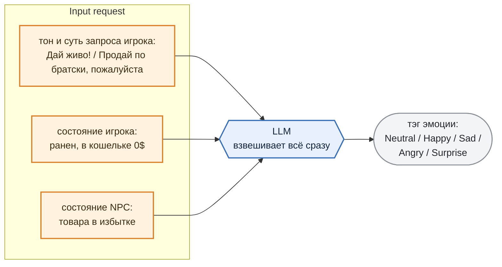

# 3. Expressive Agent

Эмоция NPC — это **результат оценки ситуации**, в которой он (NPC) оказался. LLM взвешивает тон запроса игрока, состояние игрока и NPC и реагирует соответственно.

Игрок хамит, но принёс редкий трофей да ещё и ранен — LLM взвешивает всё вместе и может выдать `Surprise` вместо ожидаемого `Angry`. Один и тот же вопрос в разном состоянии даёт разную реакцию.

И тэг приходит **вместе с ответом** — в поле `emotion` того самого объекта из раздела 1.

Значение всегда одно из пяти: `Neutral`, `Happy`, `Sad`, `Angry`, `Surprise`. Никаких "Восторженно-печальный" модель придумать не может — допустимые тэги перечислены прямо в грамматике (раздел 4).

***

## Тэг эмоции -> голос и мимика

Дальше тэг эмоции расходится по двум каналам и "оживляет" MetaHuman:

> *Что такое MetaHuman и почему лицо и губы — это два разных канала*
>
> *MetaHuman — система готовых персонажей в UE с полноценным лицевым ригом: лицо анимируется не "картинкой", а как скелет, отдельными контролами.*
>
> *Мимика — это зацикленная анимация лица. В проекте лежат готовые клипы под каждую эмоцию (*`Face_Joy`*,&#x20;*`Face_Anger`*,&#x20;*`Face_Neutral`*&#x20;и так далее), тэг эмоции просто позволяет выбирать нужный.*
>
> *LipSync — независимый канал: плагин анализирует само аудио (при его воспроизведении) и генерирует по нему движение губ.*

В DataAsset персонажа, в поле `NpcVoices`, лежат **сэмплы голоса с разными эмоциями** — по одному на каждый тэг: `Neutral`, `Happy`, `Sad`, `Angry`, `Surprise`.

И это **референсы для клонирования**, а не готовые реплики.

Пришёл тэг `Happy` — берём соответствующий сэмпл как образец тембра и настроения и **в реальном времени синтезируем этим голосом сам текст ответа** из поля `answer`.

Так NPC произносит любую сгенерированную фразу своим голосом и с нужной эмоцией. Параллельно тэг включает мимику, а lipsync подгоняет движение губ под получившееся аудио.

Как это выглядит вживую — на видео ниже.

> 🎬 **Видео:** NPC последовательно произносит пять реплик — по одной на `Neutral`, `Happy`, `Sad`, `Angry` и `Surprise`. Тэг задаётся напрямую, LLM в этом ролике не участвует.

***

Теперь NPC может проявлять характер и *реагировать на игрока*. Осталось сделать так, чтобы он ещё и *взаимодействовал с игроком*.
