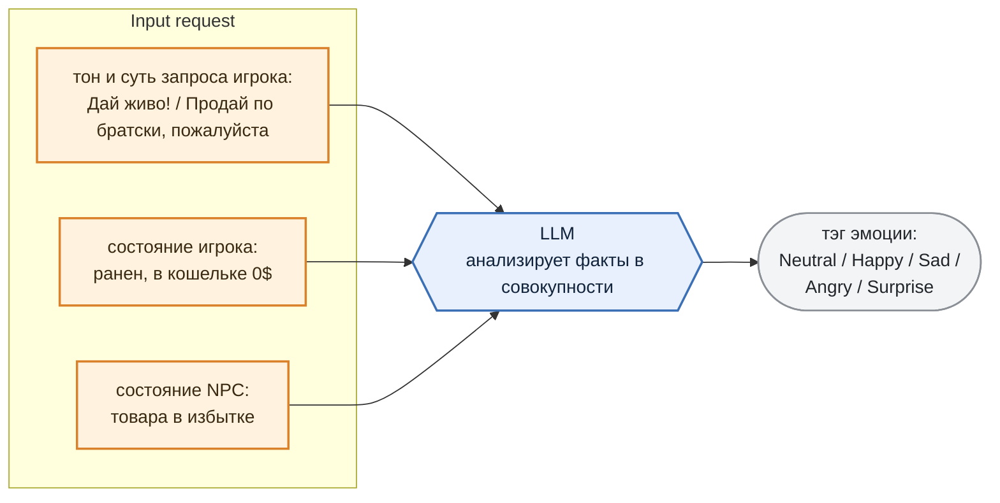
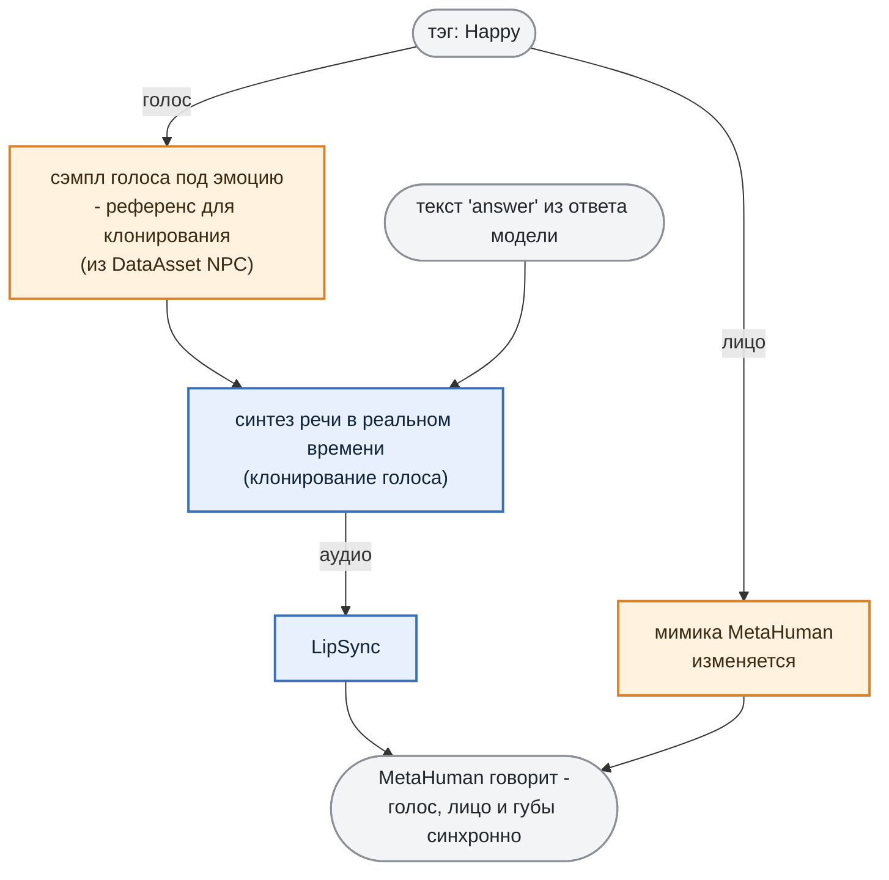

# 3. NPC чувствует: Expressive Agent

Эмоция NPC - это **результат оценки ситуации**, в которой он (NPC) оказался. LLM взвешивает тон запроса игрока, состояние игры и реагирует соответственно.

Игрок хамит, но он ранен, а в кошельке ноль: LLM взвешивает всё вместе и реагирует "`Sad"` - торговцу его скорее жалко, чем обидно. Одна и та же фраза в разном состоянии даёт разную реакцию.

И тэг приходит **вместе с ответом** - в поле `emotion` того самого объекта из раздела 1.

Значение всегда одно из пяти: `Neutral`, `Happy`, `Sad`, `Angry`, `Surprise`. Никаких "Восторженно-печальный" модель придумать не может - допустимые тэги перечислены прямо в грамматике (раздел 4).

***

## Тэг эмоции -> голос и мимика

Тэг эмоции расходится по двум каналам (анимация лица и генерация голоса + lip sync) "оживляя" MetaHuman:

> *Что такое MetaHuman и как работает мимика и lipsync*
>
> *MetaHuman - система готовых персонажей в UE с полноценным лицевым ригом.*
>
> *Мимика - это зацикленная анимация лица. В проекте лежат готовые клипы под каждую эмоцию (*`Face_Joy`*,&#x20;*`Face_Anger`*,&#x20;*`Face_Neutral`*&#x20;и так далее), тэг эмоции просто позволяет выбирать нужный.*
>
> *LipSync - независимый канал: плагин анализирует аудио голоса (при его воспроизведении) и генерирует по нему движение губ. При этом анимация движения губ "смешивается" с анимацией лица.*

В DataAsset персонажа, в поле `NpcVoices`, лежат **сэмплы голоса с разными эмоциями** - по одному на каждый тэг: `Neutral`, `Happy`, `Sad`, `Angry`, `Surprise`.

И это **референсы для клонирования**, а не готовые реплики.

Пришёл тэг `Happy` - берём соответствующий сэмпл и **в реальном времени синтезируем этим голосом сам текст ответа** из поля `answer`.

Так NPC произносит любую сгенерированную фразу своим голосом и с нужной эмоцией. Параллельно тэг включает мимику, а lipsync подгоняет движение губ под получившееся аудио.

Как это выглядит вживую - на видео ниже.

> 🎬 **Видео:** NPC последовательно произносит пять реплик — по одной на `Neutral`, `Happy`, `Sad`, `Angry` и `Surprise`. Тэг задаётся напрямую, LLM в этом ролике не участвует.

***

Теперь NPC может проявлять характер и *реагировать на игрока*. Осталось сделать так, чтобы он мог*взаимодействовать с игроком*.
