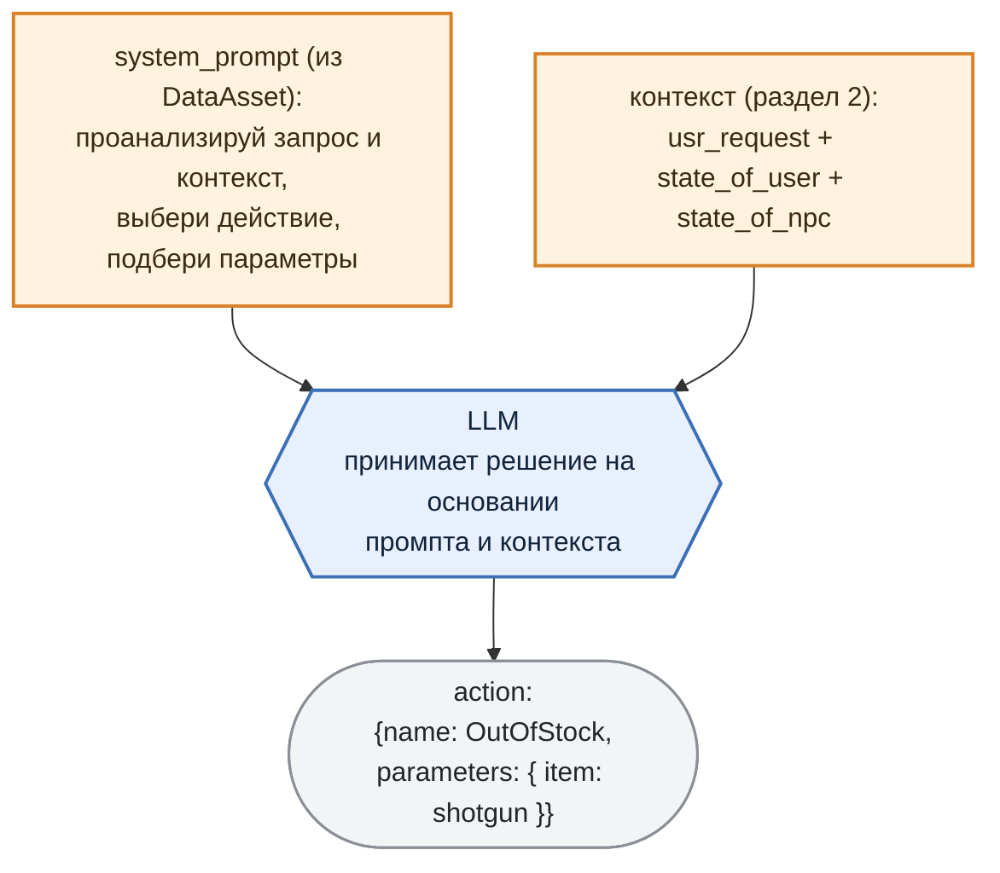
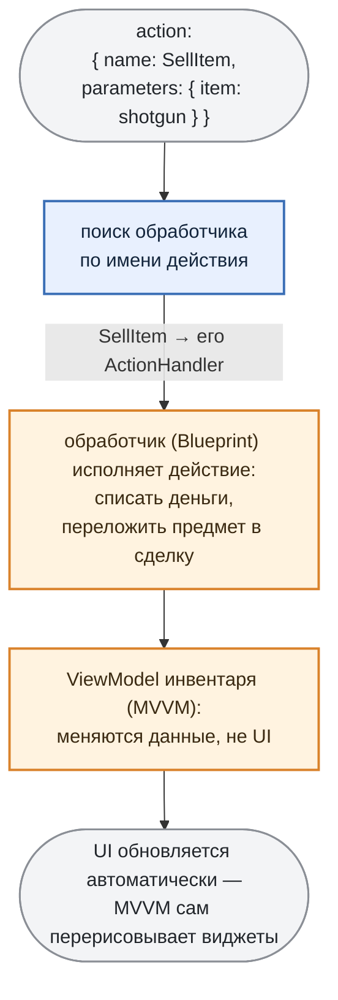

# 4. Agent function-calling

***

## Идея

Идея простая:

Вместе с текстовым ответом модель возвращает **машинно-исполнимую команду (action)** — имя действия и его параметры. Игровая логика находит обработчик по имени действия и исполняет команду напрямую: списывает деньги, кладёт товар в сделку, обновляет интерфейс.

То есть фраза "продай-ка мне аптечку" не просто получает вежливый ответ, но и **приводит к реальным изменениям в игре**. Именно здесь начинаются проблемы, за которые все не любят "LLM в проде":

* Модель может ответить действием, **которого не существует** ("выдать скидку 300%").

* Может назвать **правильное действие с невалидными параметрами** (`item: "дробовик"` вместо "`shotgun"`).

* Может завернуть команду в **невалидный JSON** — лишняя запятая, болтовня вокруг, markdown-заборчик ` ``` `.

***

## Как гарантировать валидность и исполнимость команды

Если утрировать, то LLM работает строго по инструкции из **системного промпта**: проанализировать запрос вместе с контекстом (см. раздел 2), выбрать самое подходящее действие и подобрать параметры:



Главное свойство здесь — **одна и та же фраза даёт разное действие в зависимости от контекста.** "Продай дробовик" при отсутствии у торговца товара превратится в `OutOfStock`, при нехватке денег у игрока — в `NotEnoughGoldToBuy`, а если все ок — в `SellItem`. Все это решает LLM.

К сожалению сама по себе LLM такой аккуратный json-объект выдаёт не всегда. Поэтому нужно ввести два правила при инференсе которые направляют LLM:

1. **инструкция** — тот самый системный промпт из схемы. Он делает две вещи: задаёт **форму** — вернуть *один объект структуры* `emotion` + `answer` + `action` (см. раздел 3), а не plain-текст; и задаёт **правила выбора** — перечисляет все доступные действия и описывает, в каком случае какое вызывать (например, `DoNothing` — когда вопрос вообще не по адресу торговца), вместе со строгими требованиями к параметрам каждого. Это *что* и *когда* мы хотим получить.

2. **ограничение** — грамматика на уровне сэмплинга не даёт свернуть с этой формы: **страхует** и от галлюцинаций по содержанию, и от некорректного формата — на выходе гарантированно валидный JSON и ничего кроме него (модель не допишет "Вот держите: {…}" и не сломает кавычки).

Инструкцию мы уже разобрали (это просто декларация в system prompt). Самое интересное — это грамматика.

Грамматики **GBNF** из `llama.cpp` работают радикально: мы не *просим* модель выдать валидный JSON, мы **запрещаем ей на уровне сэмплинга генерировать что-либо, кроме валидного JSON нужной формы**.

Как это работает: на каждом шаге модель выбирает следующий токен из распределения вероятностей. Грамматика на этом же шаге **вычёркивает все токены, которые нарушили бы схему**. Открыли `{` — дальше разрешён только `"emotion"`. После него — только двоеточие. И так далее — в итоге любой сгенерированный ответ гарантированно валиден.

Вот пример грамматики (почищена от служебных символов) нашего торговца:

```gbnf
root      ::= Response
Response  ::= "{" ws "emotion":  ws emotions "," ws "answer": ws string "," ws "action": ws Action ws "}"

Action    ::= "{" ws "name": ws actions "," ws "parameters":" ws dict "}"

emotions  ::= "Neutral" | "Angry" | "Happy" | "Sad" | "Surprise"

actions   ::= "SellItem" | "NotEnoughGoldToBuy" | "OutOfStock"
            | "ShowItemsByCategory" | "ShowItem" | "DoNothing"
```

Обратите внимание на две строки — `emotions` и `actions`. **Все допустимые эмоции и все допустимые действия перечислены прямо в грамматике.** Модель физически не сможет выдать эмоцию не из пяти или действие, которого у торговца нет: этих вариантов для неё просто не существует на уровне сэмплинга. Не нужно валидировать `"action": "give_discount_300%"` пост-фактум — такой токен-путь заблокирован.

> Ни грамматику, ни системный промпт, ни базу знаний из раздела 2 не пишут руками — все они собираются из описания NPC в DataAsset. Как устроен этот генератор (целый MLOps-пайплайн) — отдельная тема следующей статьи; здесь достаточно знать: добавить действие = поправить DataAsset.

***

## Исполнение: ActionHandler → Unreal GameLogic

Команду (и параметры) получили. Дальше LLM уже не при делах — за работу берётся игровая логика.

За исполнение отвечает **ActionHandler**: по имени действия из ответа мы находим нужный обработчик и вызываем его.



> **Обработчик — расширяемый.** Базовый обработчик в C++ ничего не делает; вся конкретика (что значит "продать дробовик") пишется в **Blueprint** реализации. Каждому действию NPC в его DataAsset соответствует свой обработчик\ActionHandler.

Теперь у нас есть всё: NPC который **знает&#x20;**&#x43E;б игровом мире (разделы 2), **реагирует&#x20;**&#x43D;а игрока и **действует** меняя состояние игры.

***
