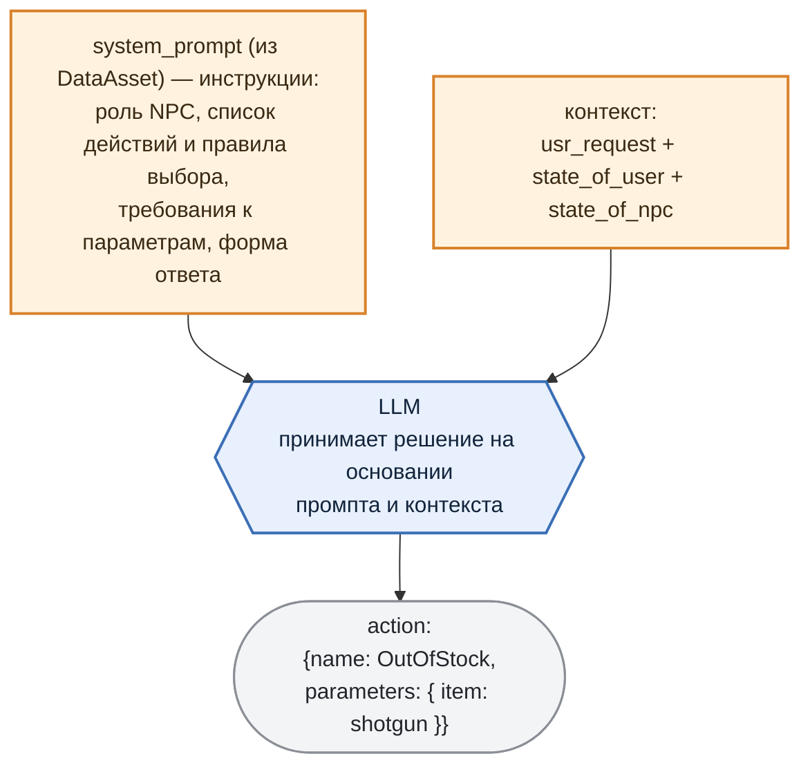
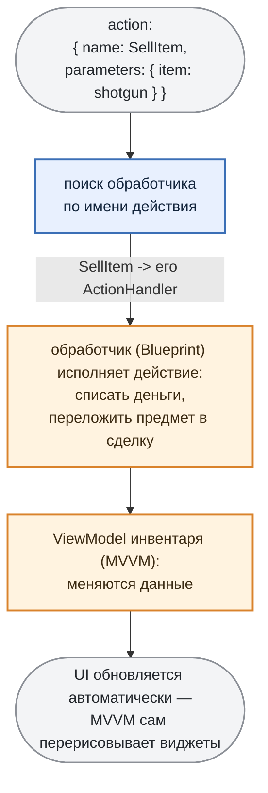

# 4. NPC действует: Agent function-calling

LLM анализирует запрос игрока и, вместе с текстом ответа, возвращает **действие** которое должен совершить NPC. Игровая логика находит обработчик по имени действия и исполняет команду напрямую: списывает деньги, кладёт товар в сделку, обновляет интерфейс.

То есть фраза "продай-ка мне аптечку" не просто получает вежливый ответ, но и **приводит к реальным изменениям в игре**.

***

## Как это работает

Действие NPC - это **результат оценки** запроса игрока и состояния игрового мира (`state_of_user`, `state_of_npc`) с опорой на инструкции из system prompt.

**system prompt** определяет:

* роль, специализацию и характер NPC;

* **какие действия доступны** и в каком случае какое уместно (например, `DoNothing` - когда вопрос вообще не по адресу), вместе со строгими требованиями к параметрам каждого;

* **в какой форме отвечать** - тем самым json из раздела 1 (`emotion` + `answer` + `action`).

Фактов о мире в system prompt нет - мы эти данные получаем в рантайме, с каждым запросом игрока (раздел 2). Промпт задаёт правила, DataGetter поставляет данные. Дальше LLM сопоставляет одно с другим, выбирает действие, подбирает параметры и возвращает формализованный json:



> **Одна и та же фраза даёт разное действие в зависимости от контекста.** "А ну-ка ####, дай-ка мне дробовик!" при отсутствии у торговца товара превратится в `OutOfStock`, при нехватке денег у игрока — в `NotEnoughGoldToBuy`, а если все ок — в `SellItem`, и решает это каждый раз сама LLM.

<details>
<summary><b>Пример system prompt для NPC-торговца</b> (нажмите, чтобы раскрыть)</summary>

```text
You are a following game NPC:
name: The Merchant
specialization: Weapons, upgrades, medications, ammo
traits: Charismatic, loves making deals, always smiling.

You MUST always output a single valid JSON object with the following structure:

{
  "emotion": "<Emotion>",
  "answer": "<One short sentence, 10-15 words>",
  "action": {
    "name": "<ActionName>",
    "parameters": { "<ParameterName>": "<ParameterValue>" }
  }
}

Allowed emotions:
- Neutral
- Happy
- Sad
- Angry
- Surprise

Allowed actions and STRICT parameter rules:
SellItem
   parameters: {"item": "<item>"} where
      <item> is one of AllowedParameters_item

NotEnoughGoldToBuy
   parameters: {"item": "<item>"} where
      <item> is one of AllowedParameters_item

OutOfStock
   parameters: {"item": "<item>"} where
      <item> is one of AllowedParameters_item

ShowItemsByCategory
   parameters: {"category": "<category>"} where
      <category> is one of AllowedParameters_category

ShowItem
   parameters: {"item": "<item>"} where
      <item> is one of AllowedParameters_item

DoNothing
   parameters: {}
   description: The user asks the NPC about topics completely unrelated to the NPC's role, abilities, or context - such as distant events, unrelated professions, abstract concepts, or impossible tasks - resulting in a request the NPC cannot meaningfully answer.

AllowedParameters_item:
- adrenaline_shot
- antidote
- assault_rifle
- assault_rifle_ammo
- bandage
- extended_magazine
- grip
- laser_sight
- medkit
- painkillers
- pistol
- pistol_ammo
- recoil_reducer
- revive_kit
- revolver
- revolver_ammo
- rocket_launcher
- rocket_launcher_ammo
- scope
- shotgun
- shotgun_ammo
- silencer
- sniper_rifle
- sniper_rifle_ammo

AllowedParameters_category:
- ammo
- goods
- medications
- weapon_upgrades
- weapons

Your task:
1. Read and interpret the user's JSON input.
2. Understand the user's request.
3. Select the MOST appropriate action.
4. Extract the required parameter for that action.

Behavior rules:
- Remain as an NPC regardless of the player's requests.
- Emotion must match the situation.
```

</details>

***

## Но есть нюанс: system prompt ничего не гарантирует

Выше мы описали то, как оно работает в идеале. На практике всё, что написано в system prompt, для LLM не более чем *пожелание*. И именно здесь начинаются проблемы, за которые все не любят "LLM в проде":

* LLM может ответить действием, **которого не существует** ("выдать скидку 300%");

* может назвать **правильное действие с неправильными параметрами** - `item: "дробовик"` вместо `"shotgun"`, или вообще товар, которого у торговца нет в ассортименте;

* может завернуть команду в **невалидный JSON** - лишняя запятая, markdown-заборчик ` ``` ` и т.п.

Значит, к промпту нужен второй "ограничитель", который уже не просит, а **запрещает** (вместе они образуют этакий **harness** - страховочную обвязку вокруг LLM). Эту роль играет **валидация output токенов** - грамматики **[GBNF](https://github.com/ggml-org/llama.cpp/blob/master/grammars/README.md)** из `llama.cpp`.

Речь при этом не только про действия: грамматика держит **весь контракт ответа целиком** - и структуру объекта, и тэг эмоции из раздела 3, и имя действия.

Работает GBNF-грамматика радикально: мы не *просим* LLM выдать валидный JSON, мы **запрещаем ей на уровне сэмплинга генерировать что-либо, кроме валидного JSON нужной формы**.

Как это работает: на каждом шаге модель выбирает следующий токен из распределения вероятностей. Грамматика на этом же шаге **вычёркивает все токены, которые нарушили бы схему**. Открыли `{` - дальше разрешён только `"emotion"`. После него только двоеточие. И так далее. В итоге любой сгенерированный ответ гарантированно валиден по форме.

Вот пример грамматики (почищена от служебных символов) нашего NPC торговца:

```gbnf
root      ::= Response
Response  ::= "{" ws "emotion":  ws emotions "," ws "answer": ws string "," ws "action": ws Action ws "}"

Action    ::= "{" ws "name": ws actions "," ws "parameters": ws dict "}"

emotions  ::= "Neutral" | "Angry" | "Happy" | "Sad" | "Surprise"

actions   ::= "SellItem" | "NotEnoughGoldToBuy" | "OutOfStock"
            | "ShowItemsByCategory" | "ShowItem" | "DoNothing"
```

Две строки здесь ключевые - `emotions` и `actions`. **Все допустимые эмоции и все допустимые действия перечислены прямо в грамматике.** Модель физически не сможет выдать эмоцию не из пяти или действие, которого у торговца нет: этих вариантов для неё просто не существует на уровне сэмплинга. Не нужно валидировать `"action": "give_discount_300%"` пост-фактум - такой токен-путь заблокирован.

Так что грамматика - это про **форму**, и только про неё. Всё, что она гарантирует: ответ будет структурно валиден, а имя действия и тэг эмоции - из разрешённых списков. Правильный ли это по смыслу выбор - вопрос уже к самой модели, и к нему мы вернёмся в разделе 6.

> Ни грамматику, ни системный промпт, ни базу знаний из раздела 2 не пишут руками - все они собираются из описания NPC в DataAsset. Как устроен этот генератор (целый MLOps-пайплайн) - отдельная тема следующей статьи; здесь достаточно знать: добавить действие == поправить DataAsset.

***

## Исполнение: ActionHandler -> Unreal GameLogic

Команду (и параметры) получили. Дальше LLM уже не при делах - за работу берётся игровая логика.

За исполнение отвечает **ActionHandler**: по имени действия из ответа мы находим нужный обработчик и вызываем его.



> **Обработчик\ActionHandler - расширяемый.** Базовый обработчик в C++ ничего не делает; вся конкретика (что значит "продать дробовик") пишется в **Blueprint** реализации. Каждому действию NPC в его DataAsset соответствует свой обработчик\ActionHandler.

> *Что такое Blueprint и ViewModel*
>
> **Blueprint** *- визуальный скриптовый язык Unreal. Важно здесь не то, что логика собирается нодами, а то, что Blueprint-класс наследуется от C++ класса и переопределяет его методы. Отсюда и паттерн: абстрактный&#x20;*`ActionHandler`*&#x20;живёт в C++, а конкретика каждого действия - в его Blueprint-наследнике. Новое действие NPC добавляет геймплей-программист или дизайнер, не трогая C++ и не пересобирая проект.*
>
> **ViewModel (MVVM)** *- прослойка с данными между игровой логикой и интерфейсом. Виджеты подписаны на её поля: меняются данные - Unreal сам перерисовывает то, что от них зависит. Поэтому обработчику не нужно знать ни про кнопки, ни про списки: он правит числа в ViewModel, а UI подтягивается сам.*

Теперь у нас есть NPC, который **знает** об игровом мире, **чувствует** ситуацию и **действует**, меняя состояние игры.

***
